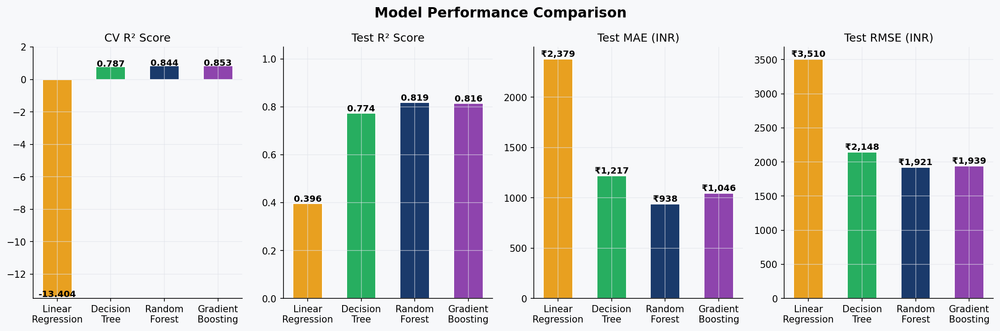

✈️ Flight Price Prediction (Machine Learning)
___
📌 Overview
Flight ticket pricing is highly dynamic, influenced by factors such as airline, route, timing, and number of stops. This project builds a machine learning regression model to predict flight prices using real-world booking data from Indian domestic flights.
The goal is to uncover key pricing drivers and develop a model capable of accurately estimating ticket prices, supporting both consumer decision-making and airline revenue strategies.
___
🎯 Business Problem
Flight prices can vary significantly for the same route due to multiple interacting factors. This creates:
- Uncertainty for travelers when booking tickets
- Optimization challenges for airlines and travel platforms

This project answers:
1. What drives flight ticket prices the most?
2. Are connecting flights always cheaper?
3. Does departure time affect pricing?
4. How accurately can we predict ticket prices?
___
📊 Dataset
Source: Kaggle (Indian Domestic Flights, 2019)
Records: 10,660 (cleaned to ~8,700)
Features include:
- Airline
- Source & Destination
- Departure & Arrival time
- Duration
- Number of stops
- Additional service information
- Target Variable: Ticket Price (INR)
___
🛠️ Tech Stack
- Programming: Python
- Libraries: Pandas, NumPy, Scikit-learn
- Visualization: Matplotlib, Seaborn
- Modeling: Linear Regression, Decision Tree, Random Forest, Gradient Boosting
___
🔍 Exploratory Data Analysis (EDA)

Key insights from the data:
+ Flight prices are right-skewed, requiring log transformation
+ Airline choice significantly impacts price (premium vs budget carriers)
+ 1-stop flights can be more expensive than non-stop (route structure effect)
+ Night flights are generally cheaper than daytime flights
+ Strong positive correlation between:
     * Duration and Price
     * Number of stops and Price
___
⚙️ Feature Engineering
* Converted duration into minutes
* Extracted:
    * Departure/arrival hour
    * Month, day, weekday
* Created flags:
    * Business class indicator
    * Weekend travel
    * Red-eye flights
* Encoded categorical variables for modeling
___
🤖 Modeling Approach

This is a supervised regression problem.
  * Models Used:
1. Linear Regression (baseline with log transformation)
2. Decision Tree
3. Random Forest
4. Gradient Boosting

  * Evaluation Strategy:
- Train-test split (80/20)
- 5-fold cross-validation
- Metrics:
   + R² Score
   + MAE (Mean Absolute Error)
   + RMSE
___
📈 Results

| Model	| Performance Summary |
|---|---|
| **Linear Regression**	| Poor fit (non-linear relationships not captured) |
| **Decision Tree** | Improved performance but high variance |
| **Random Forest** |	✅ Best overall performance |
| **Gradient Boosting** |	Strong performance, slightly below Random Forest |

🏆 Final Model: Random Forest
 - Captured non-linear relationships effectively
 - Delivered the most stable and accurate predictions
___
📊 Key Findings
1. Number of stops is the strongest price driver
2. Flight duration significantly increases cost
3. Airline brand introduces pricing premium
4. Time of travel (night vs day) affects ticket pricing
5. High-price tickets are harder to predict due to data imbalance
___
## 📊 Results Snapshot

___
⚠️ Limitations

- Dataset limited to March–June 2019 (seasonal bias)
- Booking lead time not available (critical for pricing models)
- Imbalance in high-price tickets affects prediction accuracy
___
🚀 Future Improvements

- Incorporate booking lead time data
- Use XGBoost / LightGBM for improved performance
- Deploy as a web app (Streamlit or Flask)
- Integrate real-time flight APIs
- Perform hyperparameter tuning with Optuna/GridSearch
___
💡 What This Project Demonstrates
+ End-to-end data science workflow
+ Strong EDA and business insight generation
+ Ability to handle real-world messy data
+ Practical understanding of regression modelling
+ Model evaluation and comparison
___
👤 Author

Gabriel Bello-Ososo

Data Science Enthusiast | Engineering Background

Transitioning into Data Science with a focus on real-world applications
___
⭐️ If You Found This Useful

Feel free to star the repository or connect with me!
